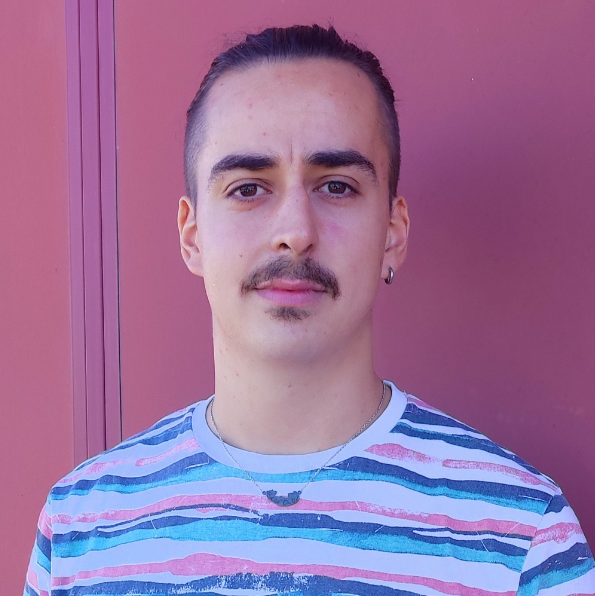

<!--  -->

My name is Pablo Luesia Lahoz. I was born in Zaragoza (Spain), and I studied Computer Engineering Degree and Master at the [Universidad de Zaragoza](https://www.unizar.es/). Currently I am a PhD student in the Graphics & Imaging Lab of Universidad de Zaragoza ([G&Ilab](https://graphics.unizar.es/)), under the supervision of [prof. Adolfo Muñoz](http://webdiis.unizar.es/~amunoz/es/) and [prof. Diego Gutierrez](http://giga.cps.unizar.es/~diegog/).

You can contact me by email: [pluesia@unizar.es](mailto:pluesia@unizar.es)

If you are interested in my code, hit my [GitHub repository](https://github.com/p-luesia)

You can download my CV from [here](./documents/CV_English.pdf) (in [Spanish](./documents/CV_Spanish.pdf))

<!-- [jekyll][jekyll-organization] /
[minima](https://github.com/jekyll/minima)

You can find the source code for Jekyll at GitHub:
[jekyll][jekyll-organization] /
[jekyll](https://github.com/jekyll/jekyll) -->

