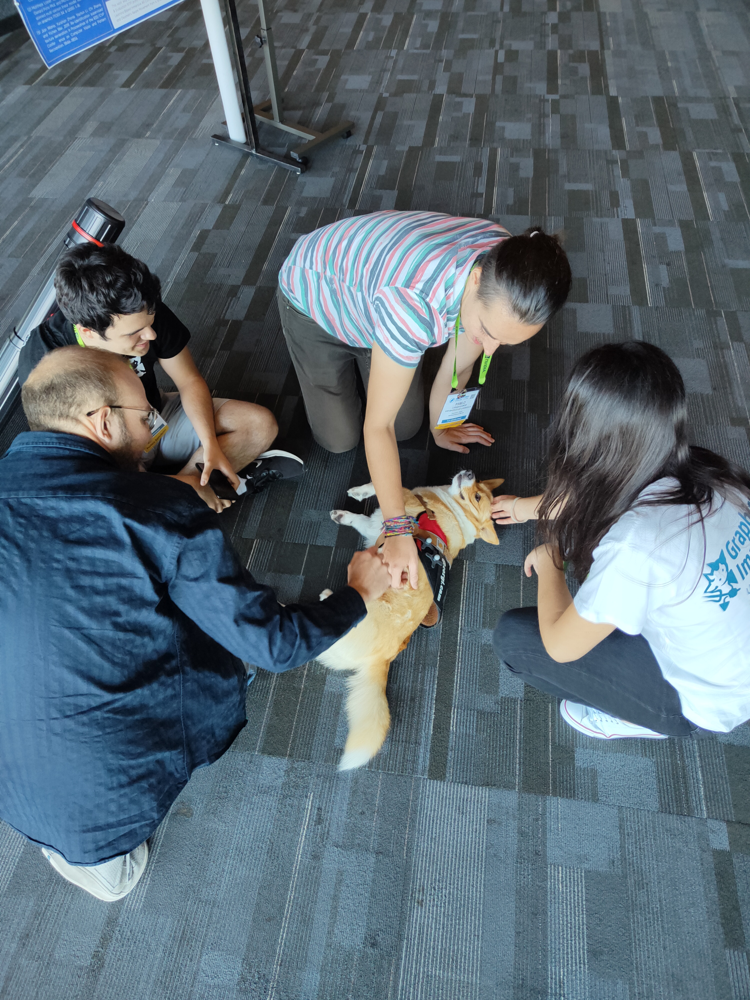
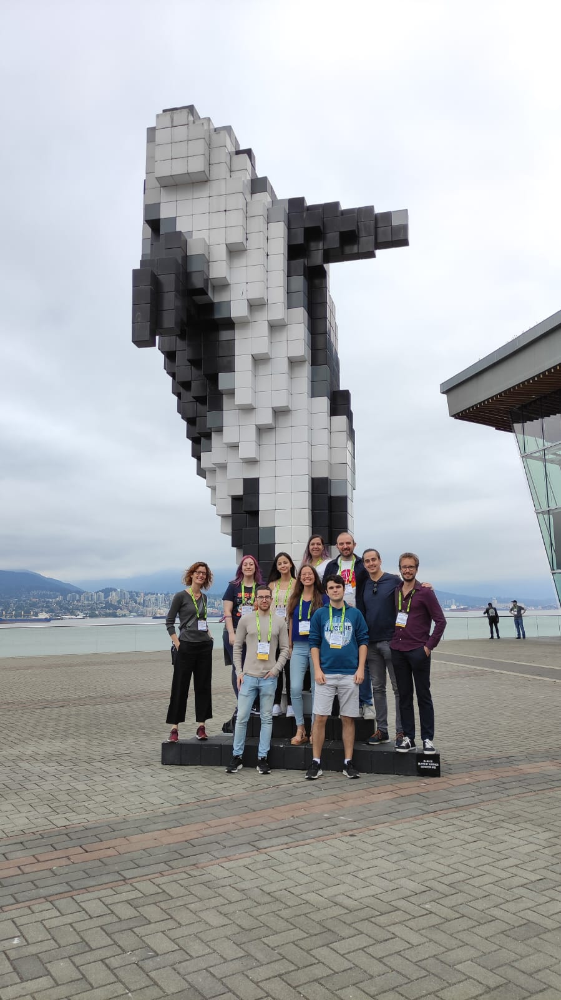

The Graphics & Imaging lab arrived to ACM SIGGRAPH 2022!!
This year the conference was helded in Vancouver, and it was a great oportunity to share our work to the community. Diego Royo, Julio Marco, and me presented the poster "Non-Line-of-Sight Transient Rendering", and we also took the oportunity to speak with some of the most prominent researchers in computer graphics.

It was altogether a great experience, but on top of that we managed to pet this incredible dog.

The emotions and work were worth it, but we needed some relax time after all.

We really enjoyed the conference. I hope we can attend soon again.

See you Vancouver!!

