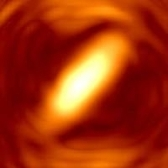

Pablo Luesia-Lahoz, Miguel Crespo, Adrian Jarabo, and Albert Redo-Sanchez

*Optics Letters 47.15 (2022): 3796-3799.*

### Abstract:
Non-line-of-sight (NLOS) imaging aims to reconstruct partially or completely occluded scenes. Recent approaches have demonstrated high-quality reconstructions of complex scenes with arbitrary reflectance, occlusions, and significant multi-path effects. However, previous works focused on surface scattering only, which reduces the generality in more challenging scenarios such as scenes submerged in scattering media. In this work, we investigate current state-of-the-art NLOS imaging methods based on phasor fieldsto reconstruct scenes submerged in scattering media. We empirically analyze the capability of phasor fields in reconstructing complex synthetic scenes submerged in thick scattering media. We also apply the method to real scenes, showing that it performs similarly to recent diffuse optical tomography methods. 

DOI: [10.1364/OL.463296](https://doi.org/10.1364/OL.463296)
