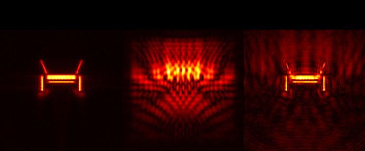

Pablo Luesia-Lahoz, Diego Gutierrez, and Adolfo Muñoz

*ICASSP 2023 - 2023 IEEE International Conference on Acoustics, Speech and Signal Processing (ICASSP), Rhodes Island, Greece, 2023, pp. 1-5*

### Abstract:
The recently introduced Phasor Fields framework for non-line-of-sight imaging allows to image hidden scenes by treating a relay surface as a virtual camera. It formulates the problem as a diffractive wave propagation, solved by the Rayleigh–Sommerfeld diffraction (RSD) integral. Efficient Phasor Fields implementations employ RSD-based kernels to propagate waves from parallel planes by means of 2D convolutions. However, the kernel storage requisites are prohibitive, hampering the integration of these techniques in memory-constrained devices and applications like car safety.Instead of relying on expensive RSD kernels, we propose the use of alternative virtual lenses to focus on the incoming phasor field and image hidden scenes. In particular, we propose using zone plates (ZP), which require significant less memory. As our results show, our ZP virtual lenses allow us to obtain reasonable reconstructions of the hidden scene, offering an attractive trade-off for memory-constrained devices. 

DOI: [10.1109/ICASSP49357.2023.10094929](https://doi.org/10.1109/ICASSP49357.2023.10094929)
