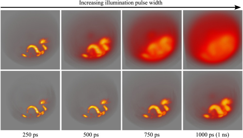

Albert Redo-Sanchez, Pablo Luesia-Lahoz, Diego Gutierrez, and Adolfo Muñoz

*Optics Express 32.6 (2024): 10505-10526.*

### Abstract:
The non-line-of-sight (NLOS) imaging field encompasses both experimental and computational frameworks that focus on imaging elements that are out of the direct line-of-sight, for example, imaging elements that are around a corner. Current NLOS imaging methods offer a compromise between accuracy and reconstruction time as experimental setups have become more reliable, faster, and more accurate. However, all these imaging methods implement different assumptions and light transport models that are only valid under particular circumstances. This paper lays down the foundation for a cohesive theoretical framework which provides insights about the limitations and virtues of existing approaches in a rigorous mathematical manner. In particular, we adopt Dirac notation and concepts borrowed from quantum mechanics to define a set of simple equations that enable: i) the derivation of other NLOS imaging methods from such single equation (we provide examples of the three most used frameworks in NLOS imaging: back-propagation, phasor fields, and f-k migration); ii) the demonstration that the Rayleigh-Sommerfeld diffraction operator is the propagation operator for wave-based imaging methods; and iii) the demonstration that back-propagation and wave-based imaging formulations are equivalent since, as we show, propagation operators are unitary. We expect that our proposed framework will deepen our understanding of the NLOS field and expand its utility in practical cases by providing a cohesive intuition on how to image complex NLOS scenes independently of the underlying reconstruction method.

DOI: [10.1364/OE.518466](https://doi.org/10.1364/OE.518466)